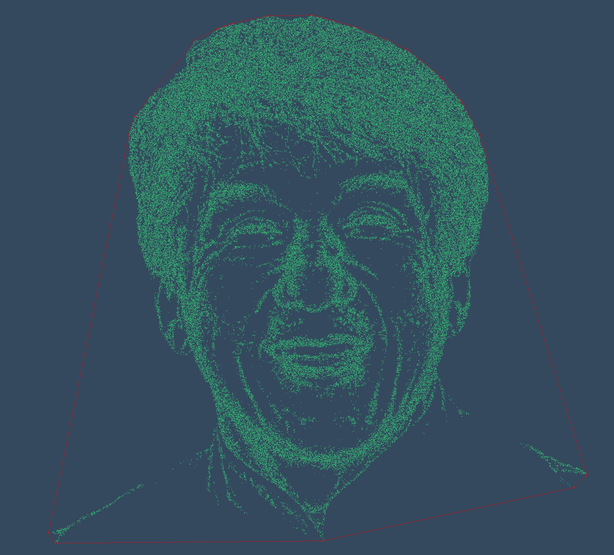

Numerical Geometry Project: Convex Hulls
========================================

This folder contains our project on convex hulls.
More precisely, four algorithms have been implemented:
 * Graham Scan
 * Jarvis March
 * Chan's Algorithm
 * Akl-Toussaint Heuristic.
 
We mainly focused on Chan's algorithm hence we provided animations for Graham Scan and Chan's algorithm but not for Jarvis march nor Akl-Toussaint heuristic (which is not very funny to animate).

To launch **the animations**, please enter 

`myexec set algo`

where `set` describes the set on which the animation is run and can take the values
 * `0` random set of points
 * `1` confused Jackie Chan
 * `2` happy Jackie Chan
 * `3` Christmas Tree 
 
and `algo` is the algorithm illustrated by the animation:
 * `0` Graham Scan
 * `1` Chan's algorithm
 
To **benchmark** our three algorithms with the Akl-Toussaint heuristic, please enter

`myexec nPoints`

with `nPoints` being an integer value egals to the size of a random set that will be convexhullised by our algorithms. The result of the benchmark will be displayed on the console.

If you simply wants to play with our **sandbox**, please enter

`myexec`

A more complete documentation for each algorithm is available in [doc/fullReadMe.md](doc/fullReadMe.md).

<!--
It should contain:
 * this file (**README.md**)
 * the description of the structure of the program in **CMakeLists.txt**
 * a **src** directory containing the the source code of your program
 * a **doc** directory containing more documentation
 * a **deps** directory containing the BOV library

See [doc/COMPILING.md](doc/COMPILING.md) for a step by step tutorial
on how to build the program.

See [doc/tutorial.md](doc/tutorial.md) for a step by step tutorial on
how to use the BOV library.

See [deps/BOV/include/BOV.h](deps/BOV/include/BOV.h)
for help on the BOV library functions.

See [deps/BOV/examples/](deps/BOV/examples/) for more
examples using the BOV library

-->
