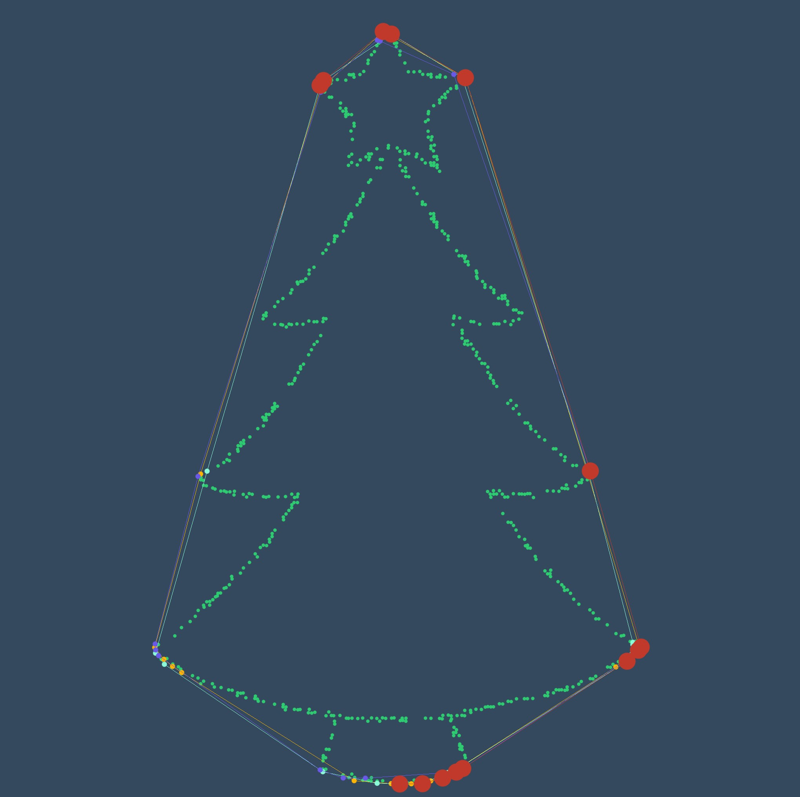
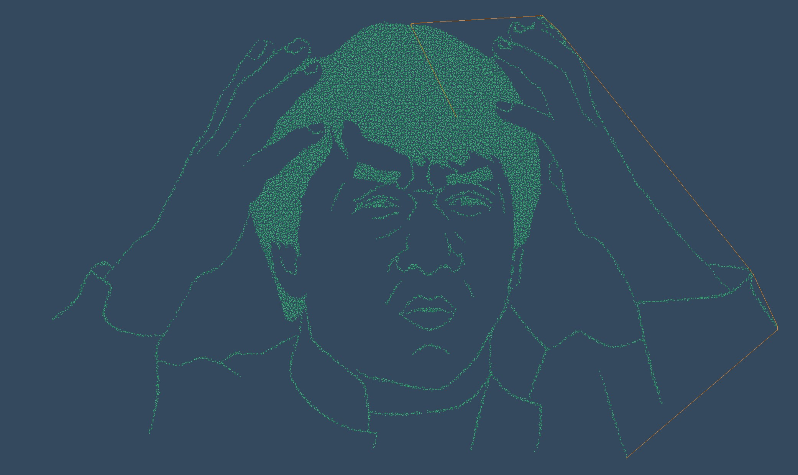
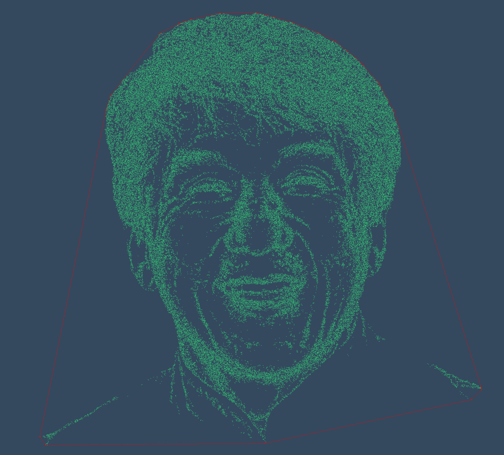

### Description of the most important files in [src/](src/)

 * `algorithm.h`
Header file of the four algorithms.
 * `chan.c`
 Contains the function implementing *Chan's algorithm*. Contains also a function allowing to compute the *tangent* to polygon starting from a point.
 * `graham.c`
  Contains the function implementing the *Graham Scan* and the *AKL-Toussaint Heuristic*
 * `inputs.c` Contains functions generating sets of points. In particular:
    * `scanFile` extracts data from a txt file,
    * `grid` generates a grid,
    * `random_points` generates a random set,
    * `circle_points` generates a circle.
 * `jarvis.c` Contains the function implementing the *Jarvis march* and a function used to handle the aligned cases (see further).
 * `main.c` ...
 * `predicates.c` Routines for Arbitrary Precision Floating-point Arithmetic and Fast Robust Geometric Predicates made by Jonathan Richard Shewchuk.
 * `predicates.h` Header file allowing to use `predicates.c` correctly
 * `utils.c` Contains various functions and the *stack* data structure useful for the Graham Scan

### Note on the aligned cases

Note that algorithms may have inconsistent behaviours for aligned cases. Sometimes they take only extreme points and sometimes they take all the aligned points. We did not consider this as dramatic, since our algorithms were mainly used for graphical purposes and retrieving all the aligned points should not be very hard if desired.

### Gallery

#### Chan

You can see the different subhulls in colour and the current points in hull in red.

#### Graham

The orange line is the tentative of hull.

### Results

And here is our dear friend Jackie Chan happy because we succeeded in implementing his algorithm !
